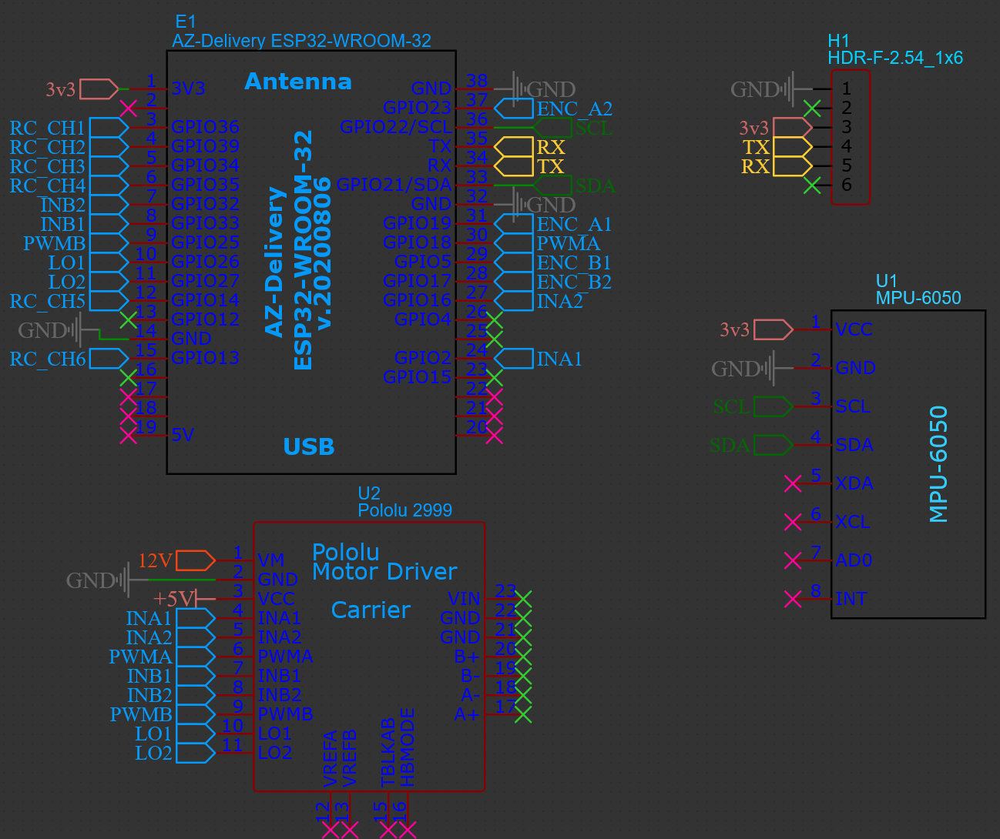

# PidSpeedControl

2 wheeled - self balancing robot

Communication is done with baud rate `115200`

Dependencies:

esp32 board by Espressif Systems - v3.0.4
ServoInput by David Madisson - v2.0.0
MPU6050_light by rfetick - v1.2.1

